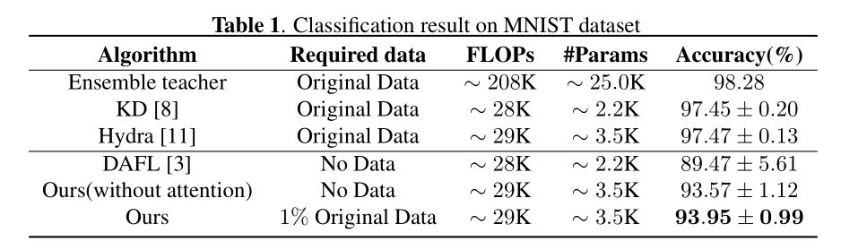
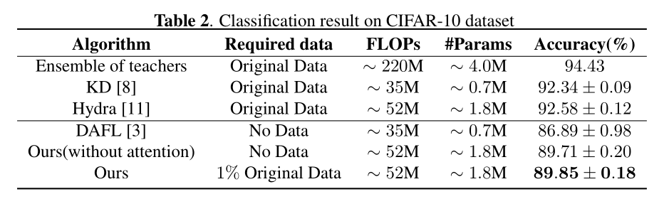

# CDFKD

Pytorch implementation of ICME 2021 paper: Model Compression via Collaborative Data-Free Knowledge Distillation for Edge Intelligence (CDFKD).


## Requirements

- python 3
- pytorch


## Run

**MNIST**

Train some teacher networks:

```shell
python teacher-train.py --batch_size=128
```

Distill knowledge of above teachers into a multi-header student network:

```shell
python CDFKD-train.py
```

(optional) Use additional data to train an attention vector for aggregating predictions:

```shell
python attention-train.py
```


**CIFAR10**

```shell
python teacher-train.py --dataset=cifar10 --batch_size=256
```

```shell
python CDFKD-train.py --dataset=cifar10 --n_epochs=800 --batch_size=1024 --lr_G=0.001 --lr_S=0.1 --latent_dim=1000 --channels=3 --oh=0.05 --ie=5 --a=0.01
```

```shell
python attention-train.py --dataset=cifar10 --data_num=500 --n_epochs=30
```


**note**: the large batch size is important for generating images uniformly distributed in each class. Decreasing its value may cause accuracy drop.


## Results






## Citation

coming soon
